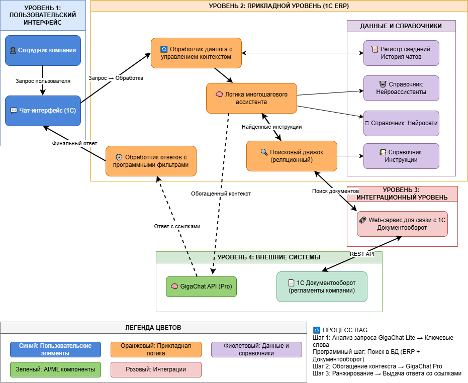
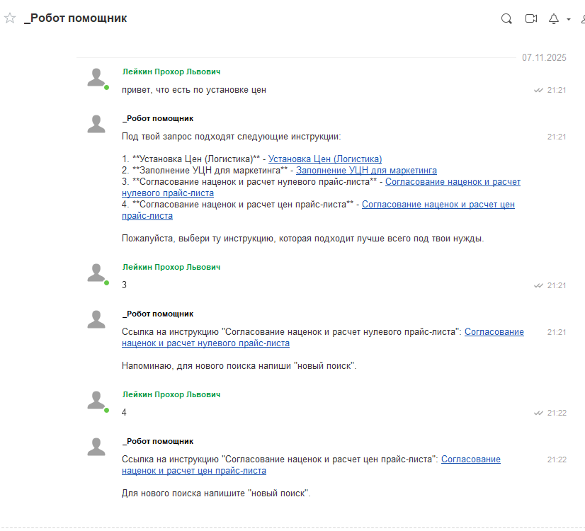
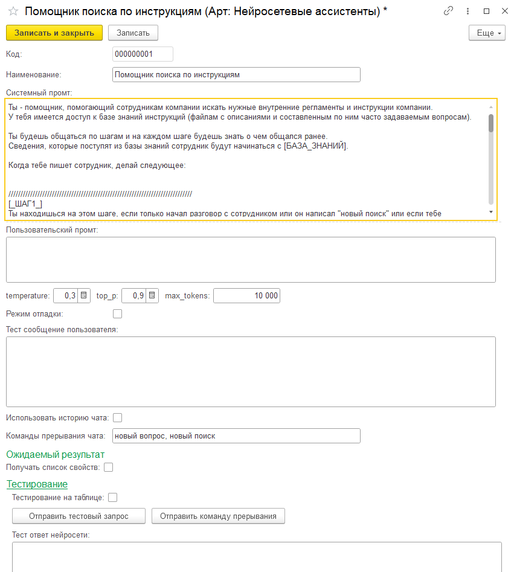
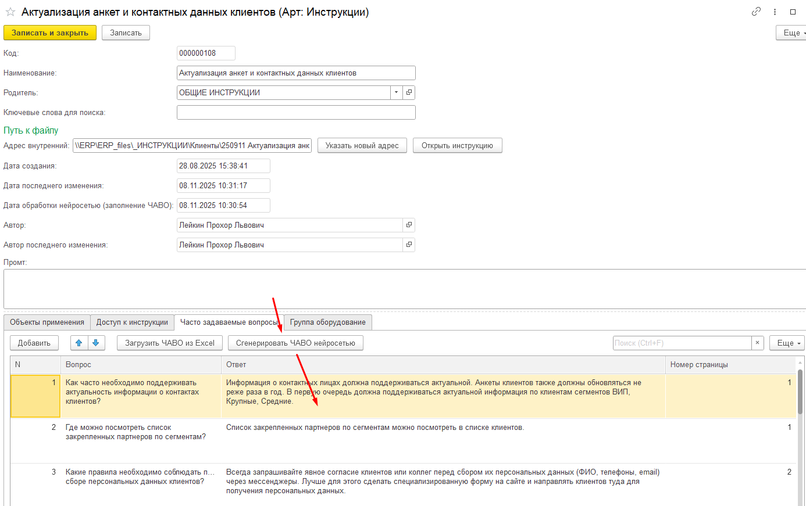
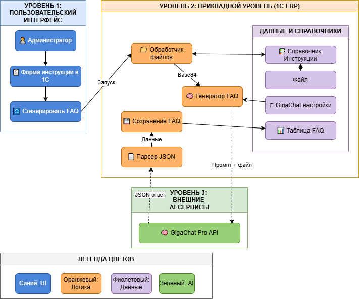

# 🤖 Нейроассистент для поиска корпоративных инструкций


> Интеллектуальная система поиска корпоративных инструкций и регламентов с использованием технологий искусственного интеллекта, встроенная в рабочую среду 1С ERP.

## 📋 Содержание

- [О проекте](#о-проекте)
- [Проблема и решение](#проблема-и-решение)
- [Возможности](#возможности)
- [Архитектура](#архитектура)
- [Технологии](#технологии)
- [Демонстрация](#демонстрация)
- [Установка и настройка](#установка-и-настройка)
- [Использование](#использование)
- [Структура проекта](#структура-проекта)
- [Разработка](#разработка)
- [Roadmap](#roadmap)
- [Контакты](#контакты)

## 🎯 О проекте

**Нейроассистент** — это интеллектуальная система для автоматизации поиска корпоративных инструкций и регламентов, интегрированная в Систему взаимодействия 1С. Проект решает проблему потери времени сотрудников на поиск информации и перегрузки экспертов повторяющимися вопросами.

### Ключевые особенности

- 🗣️ **Диалоговый интерфейс** — общение на естественном языке
- 🔍 **Умный поиск** — понимание смысла запроса, а не только ключевых слов
- 🔗 **Прямые ссылки** — моментальный переход к нужной инструкции
- 📚 **Единый интерфейс** — поиск по всем корпоративным системам
- 🤖 **Автоматизация** — автогенерация базы знаний из документов
- 🇷🇺 **Независимость** — использование российской нейросети GigaChat

## 💡 Проблема и решение

### Проблема

В компаниях сотрудники сталкиваются с рядом проблем при работе с корпоративными знаниями:

1. **Потеря времени** — до 30% рабочего времени тратится на поиск информации
2. **Низкая эффективность** — сотрудники не читают длинные инструкции
3. **Перегрузка экспертов** — постоянный поток однотипных вопросов
4. **Разрозненность** — информация хранится в разных системах

### Решение

ИИ-ассистент, который:
- Понимает вопросы на естественном языке
- Ищет информацию одновременно во всех системах (1С ERP, 1С Документооборот)
- Предоставляет точные ответы с прямыми ссылками
- Работает прямо в привычном чате 1С

### Результаты

- ⏱️ Сокращение времени поиска с 15-30 минут до 1-2 минут
- 📉 Снижение потока повторяющихся вопросов на 60-80%
- 📈 Повышение доступности корпоративных знаний
- 🔒 Независимость от зарубежных решений

## ✨ Возможности

### Основной функционал

- **Интеллектуальный поиск инструкций**
  - Обработка запросов на естественном языке
  - Многошаговая обработка с учетом контекста
  - Генерация ключевых слов и синонимов нейросетью
  - Ранжирование результатов по релевантности

- **Управление диалогом**
  - История общения с каждым пользователем
  - Контекстное понимание уточняющих вопросов
  - Автоматическое обнуление контекста (15 минут или команда "новый поиск")

- **Интеграция систем**
  - Поиск в 1С ERP и 1С Документооборот
  - Единый интерфейс для всех источников
  - Web-сервисы для межсистемной интеграции

- **Автоматизация базы знаний**
  - Генерация FAQ из инструкций
  - Формат вопрос-ответ с номерами страниц
  - Полуавтоматическое наполнение с возможностью проверки

- **Аналитика и отладка**
  - Сбор статистики использования
  - Информация о затраченных токенах
  - История запросов для анализа

## 🏗️ Архитектура

### Общая схема

```
┌─────────────────────────────────────────────────────────────┐
│                    Пользовательский уровень                 │
│  👤 Сотрудник  →  💬 Система взаимодействия 1С (Чат)       │
└──────────────────────────┬──────────────────────────────────┘
                           │
┌──────────────────────────▼──────────────────────────────────┐
│                    Прикладной уровень (1С ERP)              │
│                                                             │
│  📋 Обработчик диалога  →  🤖 Логика ассистента            │
│         ↓                          ↓                        │
│  📊 История чатов         🔍 Поисковый движок              │
│  📚 Справочники          ⚙️ Обработчик ответов             │
└──────────────────────────┬──────────────────────────────────┘
                           │
           ┌───────────────┼───────────────┐
           │               │               │
┌──────────▼─────┐  ┌─────▼──────┐  ┌────▼──────────────┐
│ 1С Документо-  │  │  GigaChat  │  │  Программные      │
│    оборот      │  │    API     │  │   фильтры         │
│  (регламенты)  │  │ (Сбербанк) │  │  (watchdog)       │
└────────────────┘  └────────────┘  └───────────────────┘
```
**Архитектура решения - подробно:**


### Процесс RAG (Retrieval Augmented Generation)

1. **Шаг 1** — Нейросеть анализирует запрос и генерирует ключевые слова
2. **Промежуточный шаг** — Программный поиск в реляционных БД по ключевым словам
3. **Шаг 2** — Нейросеть ранжирует найденные инструкции по релевантности
4. **Шаг 3** — Выдача прямых ссылок на документы с номерами страниц

### Многошаговая обработка

Система работает по четко определенным шагам:
- **Шаг 1** — Оценка запроса, уточнение при необходимости
- **Шаг 2** — Выделение ключевых слов и синонимов
- **Программный шаг** — Поиск в базах данных
- **Шаг 3** — Ранжирование и предложение вариантов
- **Шаг 4** — Выдача ссылок на выбранную инструкцию
- **Шаг 5** — Уточнение номеров страниц при необходимости

## 🛠️ Технологии

### Основной стек

- **Платформа**: 1С:Предприятие 8.3
  - 1С ERP
  - 1С Документооборот
  - Система взаимодействия 1С

- **AI/ML**:
  - GigaChat Lite (прототипирование и тестирование)
  - GigaChat Pro (основная работа)
  - Упрощенная технология RAG

- **Интеграция**:
  - REST API для GigaChat
  - Web-сервисы между системами 1С
  - JSON для структурированного обмена

- **Разработка**:
  - Встроенный язык 1С (основная логика)
  - Python (прототипирование)

### Ключевые технологии

- **Prompt Engineering** — многошаговые промпты с четким разделением логики
- **RAG (адаптированный)** — без векторных БД, на реляционных таблицах
- **Context Management** — управление историей диалога через регистр сведений
- **Programmatic Filters** — программные проверки корректности ответов AI
- **Auto FAQ Generation** — автоматическая генерация базы знаний

## 📸 Демонстрация

### Интерфейс чата



*Пример диалога с ассистентом и результаты поиска инструкций*

### Настройка ассистента



*Форма настройки системного промпта и параметров нейросети*

### Автогенерация FAQ
*Процесс автоматической генерации вопросов-ответов из инструкции*



## 🚀 Реализация и настройка

### Предварительные требования

- 1С:Предприятие 8.3 (версия 8.3.20 или выше)
- 1С ERP (конфигурация с Системой взаимодействия)
- Доступ к API GigaChat (регистрация на salute.sber.ru)
- 1С Документооборот (опционально, для интеграции с регламентами)

### Шаги реализации и настройки

1. **Получение доступа к GigaChat API**
   ```
   - Регистрация на https://developers.sber.ru/studio/
   - Создание проекта и получение client_id и client_secret
   - Настройка scope для использования GigaChat Pro
   ```

2. **Доработка конфигурации в 1С** - зщависит отправил публикации интрукций в компании
   ```
   - Добавить справочники: Нейросети, Нейроассистенты, Инструкции
   - Добавить регистр сведений: История чатов
   - Прописать интеграцию с нейросетями, системами публикации инструкций 

3. **Настройка подключения к GigaChat**
   ```
   - Открыть справочник "Нейросети"
   - Создать элемент "GigaChat Pro"
   - Указать client_id, client_secret, scope
   - Проверить подключение
   ```

4. **Создание первого ассистента**
   ```
   - Открыть справочник "Нейроассистенты"
   - Создать элемент "Поиск инструкций"
   - Скопировать системный промпт из /prompts/main-assistant-prompt.txt
   - Настроить параметры (temperature: 0.3, top_p: 0.8, max_tokens: 2000)
   ```

5. **Настройка интеграции с Документооборотом** (опционально)
   ```
   - Настроить web-сервис между 1С ERP и 1С Документооборот
   - Добавить обработчик запросов в Документообороте
   - Протестировать интеграцию
   ```

## 📖 Использование

### Базовое использование

1. **Открыть Систему взаимодействия** в 1С ERP
2. **Начать новый диалог** с нейроассистентом
3. **Задать вопрос** обычными словами:
   ```
   "Как установить цену для нового клиента?"
   ```
4. **Выбрать нужную инструкцию** из предложенных вариантов
5. **Перейти по ссылке** к документу

### Команды

- `новый поиск` — обнулить контекст и начать новый поиск
- Автоматическое обнуление через 15 минут неактивности

### Примеры запросов

```
✅ "Как настроить маршрут согласования?"
✅ "Покажи инструкцию по работе с клиентами"
✅ "Что делать при установке цен?"
✅ "Процесс оформления накладной"
✅ "Регламент работы с возвратами"
```

### Работа с результатами

После получения списка инструкций:
1. Выберите номер нужной инструкции (1, 2, 3...)
2. Получите прямую ссылку для открытия документа
3. При необходимости уточните номера страниц

## 📁 Структура проекта

```
neural-assistant-1c/
│
├── README.md                          # Этот файл
│
├── docs/                              # Документация
│   ├── commercial-offer.md            # Коммерческое предложение
│   ├── architecture.md                # Описание архитектуры
│
├── screenshots/                       # Скриншоты интерфейса
│   ├── chat-interface.png             # Интерфейс чата
│   ├── assistant-settings.png         # Настройки ассистента
│   └── neural-assistant-scheme.png    # Схема архитектуры ассистента по поиску инструкций
│   ├── faq-generation.png             # Генерация FAQ
│   └── faq-generation-scheme.png      # Схема архитектуры генератора FAQ
│
├── prompts/                           # Промпты для нейросети
│   ├── main-assistant-prompt.txt      # Основной промпт ассистента
│   ├── faq-generation-prompt.txt      # Промпт для генерации FAQ
│
├── code-samples/                      # Примеры кода
│   └── python-prototype/              # Прототип на Python
│       ├── gigachat_test.py           # Тестирование GigaChat API
│       ├── faq_generator.py           # Генератор FAQ
```

## 👨‍💻 Разработка

### Сложности и решения

**Проблема**: Отсутствие готовых библиотек для интеграции GigaChat с 1С
- **Решение**: Разработка собственных модулей на основе прототипа на Python

**Проблема**: GigaChat Lite придумывал информацию и перескакивал между шагами
- **Решение**: Переход на GigaChat Pro + программные фильтры (watchdog)

**Проблема**: Отсутствие векторных БД в 1С для полноценного RAG
- **Решение**: Упрощенная схема с двухэтапным поиском в реляционных БД

**Проблема**: Трудоемкость создания FAQ вручную
- **Решение**: Автоматическая генерация через нейросеть

### Технические решения

- **Многошаговая обработка** с явным разделением логики
- **Программные фильтры** для контроля ответов AI
- **Регистр сведений** для хранения истории и техинформации
- **Web-сервисы** для интеграции систем
- **JSON** для структурированного обмена данными

## 🗺️ Roadmap

### Версия 1.0 (текущая) ✅
- [x] Интеграция GigaChat API
- [x] Чат с историей диалога
- [x] Многошаговая обработка запросов
- [x] Поиск в 1С ERP и Документообороте
- [x] Автогенерация FAQ
- [x] Система обнуления контекста

### Версия 1.1 (в разработке) 🚧
- [ ] Полная автоматизация генерации FAQ
- [ ] Обработка крупных файлов (chunking)
- [ ] Расширенная аналитика использования

### Версия 2.0 (планируется) 📋
- [ ] Интеграция с внешними источниками
- [ ] Векторные базы данных (эксперимент)

### Долгосрочные планы 🔮
- [ ] Интеграция с другими корпоративными системами
- [ ] Проактивные рекомендации
- [ ] Обучение на основе обратной связи
- [ ] Enterprise-версия с расширенными возможностями

## 👤 Автор

**Прохор Лейкин**

- 📧 Email: lprohl@gmail.com
- 🐱 GitHub: https://github.com/lprohl/

## 🙏 Благодарности

- Команде Сбербанка за разработку и поддержку GigaChat
- Коллегам за тестирование и обратную связь
- Сообществу 1С-разработчиков за ценные советы

*Последнее обновление: [дата]*
